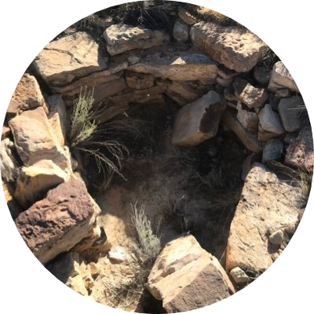

# #TheKiva 

ki·va /ˈkēvə/
noun.
- a chamber, built wholly or partly underground, traditionally used by Pueblo people for spiritual activities.

The vision behind The Kiva can be summarized in three words: _Beats, Rhymes, & Life_.

For more links to find The Kiva online, check out our [Linktree](https://linktr.ee/TheKiva).

<iframe src="https://mixlr.com/users/8853829/embed" width="100%" height="180px" scrolling="no" frameborder="no" marginheight="0" marginwidth="0"></iframe><small><a href="https://mixlr.com/thekiva" style="color:#1a1a1a;text-align:left; font-family:Helvetica, sans-serif; font-size:11px;">#TheKiva</a>. Don'forget to follow us on Twitter: @inTheKiva</small>

# #TheKiva Radio

#TheKiva Radio was inspired by _indigenous.junglist_ as way of telling stories when it comes to his interpretation of the drum. The programming provided will tap rims of many underground sounds but also provide listeners with feelgood jams and classic throwbacks.

Online radio programming will air Tuesday through Saturday. Shows will be archived and available for playback via our [Mixcloud](https://www.mixcloud.com/thekiva/) profile. Below you will find the list of shows at their various times. Thanks for listening!

-------------------------------------------------

# Monday

NO SHOW. Come hang out with us in the Discord sever.

-------------------------------------------------

# Tuesday

-------------------------------------------------
## _The Tech-Step Program_ - #TechStepPrgm
**Time:** 2100-2200.MT . (GMT -7)
### Low end theory of drum & bass.

Spatial sequences.
Tender undertones.
Autonomic accents.

_Ride the wave through the darkness._

**Labels like:** Exit Records UK, Samurai Music, 31 Records, UVB-76

-------------------------------------------------

# Wednesday

-------------------------------------------------
## _Vibe Check_ - #VIBECHECKshow
**Time:** 2100-2200.MT . (GMT -7)
### Moody beats

Tones with touch.
Vibes & volumes.
Ebb & flow.

_Get lost in your feels._

**Sounds of:** Rising talent, Soulection artists, SoundCloud Producers, Bandcamp Beatmakers

-------------------------------------------------

# Thursday

-------------------------------------------------
NO SHOW. Come hang out with us in the Discord sever.

-------------------------------------------------

# Friday

-------------------------------------------------
## _Footwork Friday_ - #FWKFriday
**Time:** 2100-2200.MT . (GMT -7)
### Bangs & Works

Experience the footwork sound & juke it out.
Basslines to help you unwind.
RIP Rashad.

_Hear the sound from Chicago that's gone global._

**Sounds of:** Chicago footwork/juke music.

-------------------------------------------------

# Saturday

-------------------------------------------------
## _#BrokenBeatTape_ - (Every Saturday)
**Time:** 1300-1400.MT . (GMT -7)
### Crooked beats w/ finesse

Future bass.
Syncopation.
Scenes.

_Forward thinking sounds_

**Sounds of:** Sounds of 20/20 LDN & similar vibes.

-------------------------------------------------

## _#SolidLiquid_ - (Every 2nd Saturday)
**Time:** 2100-2300.MT . (GMT -7)
### Atmospheric drum & bass with depth. 

Lush vocals.
Dark moods. 
Bright feels.

_Explore the deeper side of things._

**Labels like:** Integral Records, Critical Music, Fokuz Recordings, 1985 Music

-------------------------------------------------

## _#DarksideFlex_ - (Every last Saturday)
**Time:** 2100-2300.MT . (GMT -7)
### Underground dubs rooted in dark spaces. 

Deep tones.
Strong sub-bass.
Murky madness.

_Dark mode everything._

**Labels like:** Innamind Recordings, Aritkal Music UK, 1985 Music, White Peach Records

-------------------------------------------------

# Sunday

-------------------------------------------------
NO SHOW. Come hang out with us in the Discord sever.

#Thanks for stopping by!
